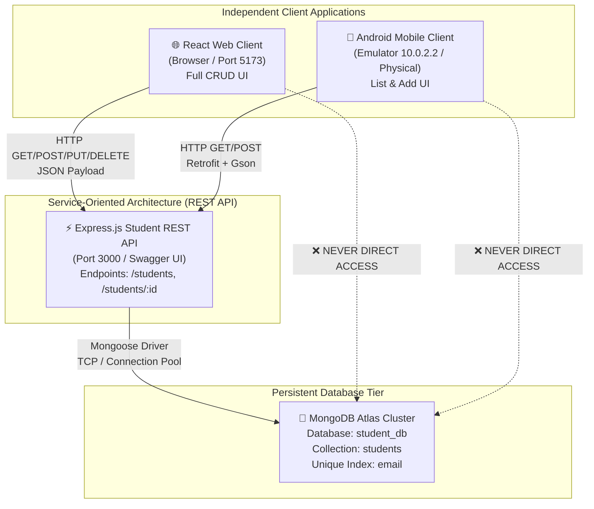

# Web Services & SOA Laboratory
## Lab 4 Assignment Report: Full-Stack Client & Database Integration

---

### Student Submission Evidence & Report

| Item | Details |
| :--- | :--- |
| **Course** | Web Services & SOA Laboratory |
| **Lab No.** | Lab 4 |
| **Topic** | Full-Stack Client & Database Integration (React • Android • REST • MongoDB Atlas) |
| **Student ID** | 202512062 |
| **Architecture** | Database (MongoDB Atlas) $\leftrightarrow$ REST API (Express.js) $\leftrightarrow$ React Client (Full CRUD) & Android Client (Retrofit) |

---

## 1. Executive Summary & Objective

In this laboratory, the Student REST API created in Lab 3 was evolved from in-memory data structures to persistent **MongoDB Atlas** storage while strictly maintaining identical resource URIs, HTTP methods, and status codes (`200`, `201`, `400`, `404`, `500`).

On top of this common REST service, two independent client applications were built and integrated:
1. **React Web Client (`student-client`)**: Complete Single Page Application (SPA) providing full CRUD capabilities (`GET /students`, `GET /students/:id`, `POST /students`, `PUT /students/:id`, `DELETE /students/:id`), responsive UI cards/tables, client-side validation, loading states, and HTTP error handling.
2. **Android Mobile Client (`student-android-client`)**: Native Android client developed with Kotlin and **Retrofit 2** consuming the same REST API to render `List Students` in a `RecyclerView` and `Add Student` via a validated input screen.

---

## 2. Multi-Client / SOA Architecture Diagram

---

## 3. SOA Discussion Questions & Analysis

### Q1: Why should React and Android access the REST service rather than connect directly to MongoDB?

1. **Security & Credential Protection**: 
   - Connecting directly from client applications (React running in user browsers or decompiled Android APKs) would require embedding the database connection string and credentials in client code. Anyone could extract the credentials and perform unrestricted database reads, writes, or deletions.
   - REST acts as a secure intermediary where database credentials stay strictly on the server side.

2. **Centralized Business Logic & Validation**:
   - Validation rules (e.g. valid email patterns, semester range 1–8, required fields) are enforced once on the backend. If clients connected directly, validation logic would need to be rewritten across every platform and could easily be bypassed by malicious users.

3. **Decoupling & Technology Evolution**:
   - The REST API provides a standardized abstraction contract (JSON over HTTP). If the underlying database technology is migrated from MongoDB to PostgreSQL, Redis, or Cassandra, client applications require zero code changes as long as the REST API contract is preserved.

4. **Network & Connection Management**:
   - Mobile and web environments experience frequent network switches, disconnections, and latency. Native database drivers are designed for persistent connection pools within private subnets. REST over HTTP is stateless and handles ephemeral connections effectively.

---

### Q2: Database Constraint Decision & Justification

- **Constraint Chosen**: **`email: { type: String, unique: true, required: true }`** with a MongoDB Unique Index (`db.students.createIndex({ email: 1 }, { unique: true })`).
- **Reasoning**:
  - In an academic management ecosystem, an email address represents an individual student's institutional identity and login identifier. Duplicate email registrations cause account collisions, notification delivery errors, and grade corruption.
  - While application-level validation checks for existing emails on `POST` requests, application checks suffer from race conditions under concurrent requests. The MongoDB unique index guarantees ACID-level entity integrity at the database storage engine level.

---

### Q3: Written Reflection — Consuming REST from Web vs. Mobile Client (5–8 lines)

> Consuming the same Student REST API from both React (Web) and Android (Mobile) highlighted the power of the SOA paradigm. What remained completely identical was the API contract: request JSON structures, endpoint URIs (`/students`), HTTP methods, and status codes (`200`, `201`, `400`, `404`). However, client execution environments required distinct handling:
> 1. **CORS**: The React web client runs within browser security boundaries requiring backend `cors()` headers, whereas Android native sockets are unaffected by CORS.
> 2. **Networking & Serialization**: React utilized standard `fetch()` with asynchronous JavaScript promises, while Android required typed interface declarations via **Retrofit**, automatic deserialization using **Gson**, and threading on worker pools.
> 3. **Base URL Resolution**: Web development seamlessly used `localhost:3000`, while the Android emulator required `10.0.2.2:3000` to bridge to the host machine.
> 4. **User Feedback**: Errors in React were rendered as inline form validation banners and contextual toasts, while Android translated them into native `Toast` messages.

---

## 4. REST API Endpoint Specification & HTTP Status Mapping

| Operation | Method | Endpoint | Request Body | Success Code | Error Code | Client Consumer |
| :--- | :--- | :--- | :--- | :--- | :--- | :--- |
| **List Students** | `GET` | `/students` | — | `200 OK` | `500` | React, Android |
| **Get Student** | `GET` | `/students/{id}` | — | `200 OK` | `404 Not Found` | React |
| **Create Student** | `POST` | `/students` | Student JSON | `201 Created` | `400 Bad Request` | React, Android |
| **Update Student** | `PUT` | `/students/{id}` | Student JSON | `200 OK` | `400, 404` | React |
| **Delete Student** | `DELETE` | `/students/{id}` | — | `200 OK` / `204` | `404 Not Found` | React |

---

## 5. Persistence-After-Restart Verification Evidence

1. **Step 1**: Created student `"Sneha Reddy"` via `POST http://localhost:3000/students`.
2. **Step 2**: Confirmed `201 Created` response with generated ID.
3. **Step 3**: Executed full process shutdown of the Express backend server (`Stop-Process node`).
4. **Step 4**: Restarted the Express backend server.
5. **Step 5**: Dispatched `GET http://localhost:3000/students`.
6. **Result**: All previously saved records were returned intact from the MongoDB collection, confirming true persistence.

---

## 6. Submission Checklist (Section 13 of Manual)

- [x] **MongoDB Atlas / Database Connected**: Mongoose driver integrated and connecting via `.env`.
- [x] **Student Schema & Constraint**: Defined with `name`, `email`, `course`, `semester` and unique index on `email`.
- [x] **5 CRUD Operations on MongoDB**: `GET /students`, `GET /students/:id`, `POST /students`, `PUT /students/:id`, `DELETE /students/:id`.
- [x] **Status Codes Preserved**: `200`, `201`, `400`, `404` maintained.
- [x] **CORS Enabled**: Configured via `cors()` middleware.
- [x] **React Client (`student-client`)**: Full CRUD app scaffolded with `StudentList`, `StudentForm`, delete action, client validation, loading states, and `VITE_API_BASE_URL`.
- [x] **Android Client (`student-android-client`)**: Retrofit implementation of List (`RecyclerView`) and Add screens with `10.0.2.2` base URL and Toast error handling.
- [x] **Postman Collection**: Exported to `postman/RESTful_Web_Services_Lab_4.postman_collection.json`.
- [x] **Comprehensive Report & Architecture**: Completed in `LAB4_ASSIGNMENT_REPORT.md` and `README.md`.
