# CampusConnect - Lab 8: Kubernetes Deployment, Basic CI/CD & Monitoring

## 1. Application Overview & Lab 7 Starting Point
In **Lab 7**, CampusConnect was enhanced with a dedicated **API Gateway** acting as a single reverse-proxy entry point and configuration-based service discovery.

In **Lab 8**, we transition the application into a production-grade **DevOps & Cloud-Native workflow**:
1. **Kubernetes Orchestration**: Containerizing into Pods, Deployments, ClusterIP Services, NodePort Gateway, and ConfigMaps inside the `lab8` namespace.
2. **Kubernetes Capabilities**: Demonstrating internal DNS service discovery, horizontal pod scaling (1 ➔ 3 replicas), and automatic self-healing.
3. **Continuous Integration (CI)**: Automated GitHub Actions workflow (`.github/workflows/ci.yml`) triggering on pushes and pull requests to install dependencies, run syntax/smoke tests, build Docker images, and validate YAML manifests.
4. **Observability & Monitoring**: Native Prometheus metrics exposition (`GET /metrics`), Prometheus scraping configuration, and Grafana dashboard visualization.

---

## 2. End-to-End System Architecture

```mermaid
graph TD
    Client["Client / Postman / Browser"]
    
    subgraph Kubernetes Cluster (Namespace: lab8)
        GW_SVC["Gateway Service (NodePort :30080 / :3000)"]
        GW_POD["API Gateway Pod\n(:3000, /metrics, /health)"]
        
        CM["ConfigMap: campusconnect-config"]
        
        US_SVC["user-service:3001 (ClusterIP)"]
        PS_SVC["product-service:3002 (ClusterIP)"]
        OS_SVC["order-service:3003 (ClusterIP)"]
        
        US_POD1["User Pod 1"]
        US_POD2["User Pod 2"]
        US_POD3["User Pod 3"]
        
        PS_POD["Product Pod"]
        OS_POD["Order Pod"]
    end
    
    subgraph Monitoring Stack
        PROM["Prometheus (:9090)\nScrapes /metrics"]
        GRAF["Grafana (:3005)\nMetrics Dashboard"]
    end

    subgraph Database Layer
        ATLAS[("MongoDB Atlas Cloud Database")]
    end

    Client -->|HTTP Traffic| GW_SVC
    GW_SVC --> GW_POD
    CM -.->|Environment Config| GW_POD
    CM -.->|Environment Config| US_POD1
    CM -.->|Environment Config| PS_POD
    CM -.->|Environment Config| OS_POD
    
    GW_POD -->|http://user-service:3001| US_SVC
    GW_POD -->|http://product-service:3002| PS_SVC
    GW_POD -->|http://order-service:3003| OS_SVC
    
    US_SVC --> US_POD1
    US_SVC --> US_POD2
    US_SVC --> US_POD3
    
    PS_SVC --> PS_POD
    OS_SVC --> OS_POD
    
    OS_POD -->|Validate User| US_SVC
    OS_POD -->|Validate Product| PS_SVC
    
    US_POD1 --- ATLAS
    PS_POD --- ATLAS
    OS_POD --- ATLAS
    
    PROM -->|Scrape metrics| GW_POD
    GRAF -->|Query| PROM
```

---

## 3. Kubernetes Deployment Guide (Part A)

### 3.1 Directory Structure (`k8s/`)
```text
k8s/
├── namespace.yaml           # Dedicated 'lab8' namespace
├── configmap.yaml           # Service URLs, ports, database URIs
├── gateway-deployment.yaml  # API Gateway Deployment
├── gateway-service.yaml     # NodePort Service (Port 3000 -> 30080)
├── user-deployment.yaml     # User Service Deployment (Scalable)
├── user-service.yaml        # User Service ClusterIP
├── product-deployment.yaml  # Product Service Deployment
├── product-service.yaml     # Product Service ClusterIP
├── order-deployment.yaml    # Order Service Deployment
└── order-service.yaml       # Order Service ClusterIP
```

### 3.2 Step-by-Step Cluster Setup & Deployment Commands
```bash
# 1. Verify Kubernetes environment & nodes
kubectl config current-context
kubectl get nodes

# 2. Create lab8 namespace
kubectl create namespace lab8

# 3. Apply all Kubernetes manifests to lab8 namespace
kubectl apply -f k8s/ -n lab8

# 4. Verify Deployments, Pods, and Services
kubectl get deployments -n lab8
kubectl get pods -n lab8
kubectl get services -n lab8
```

### 3.3 Scaling Demonstration
Scale the User Service from 1 replica to 3 replicas to demonstrate horizontal scalability:
```bash
kubectl scale deployment user-service --replicas=3 -n lab8
kubectl get pods -n lab8 -l app=user-service
```
> **Observation**: Kubernetes immediately provisions two new Pods. The `user-service` ClusterIP service automatically load-balances requests across all three healthy pods.

### 3.4 Self-Healing Demonstration
Simulate node failure or container crash by terminating a running Pod:
```bash
# Get list of running pods
kubectl get pods -n lab8

# Delete a specific User Service Pod
kubectl delete pod <user-service-pod-name> -n lab8

# Observe automatic self-healing in real-time
kubectl get pods -n lab8
```
> **Observation**: Kubernetes detects that the current state (2 pods) does not match the desired state (3 replicas), and automatically starts a new replacement pod within seconds.

---

## 4. GitHub Actions CI Pipeline (Part B)

The workflow file is located at **[`.github/workflows/ci.yml`](file:///d:/Sem%203/WSOA/CampusConnect/.github/workflows/ci.yml)**.

```mermaid
graph LR
    Push["git push / pull_request"] --> Checkout["1. Checkout Repo"]
    Checkout --> Setup["2. Set up Node 22"]
    Setup --> Deps["3. Install Dependencies"]
    Deps --> Test["4. Syntax & Smoke Tests"]
    Test --> Build["5. Docker Images Build"]
    Build --> K8sVal["6. Validate K8s Manifests"]
    K8sVal --> Pass["✅ CI Pipeline Passed"]
```



### CI Pipeline Steps:
1. **Trigger**: Executes on every `push` and `pull_request` to `main`.
2. **Environment**: Runs on `ubuntu-latest`.
3. **Dependency Installation**: Runs `npm install` across `api-gateway`, `user-service`, `product-service`, and `order-service`.
4. **Testing**: Validates Node.js syntax and executable integrity (`node -c`).
5. **Containerization**: Builds tagged Docker images for all 4 microservices (`api-gateway`, `user-service`, `product-service`, `order-service`).
6. **Manifest Validation**: Parses all YAML files in `k8s/` to ensure valid schemas.

---

## 5. Monitoring with Prometheus & Grafana (Part C)

### 5.1 Metrics Exposition (`GET /metrics`)
The API Gateway exposes standard Prometheus metrics at `http://localhost:3000/metrics`:
- **`up{service="api-gateway"}`**: Availability gauge (1 = UP, 0 = DOWN).
- **`http_requests_total{method, handler, status}`**: Counter tracking total requests broken down by route and HTTP status code.
- **`http_requests_errors_total`**: Counter tracking 4xx and 5xx error responses.
- **`process_resident_memory_bytes`**: Memory footprint in bytes.
- **`process_uptime_seconds`**: Gateway uptime.

### 5.2 Starting the Monitoring Stack
You can run Prometheus and Grafana locally via Docker Compose or Kubernetes:
```bash
# Start Prometheus & Grafana stack
docker compose -f monitoring/docker-compose.monitoring.yml up -d

# Prometheus Web UI: http://localhost:9090
# Grafana Dashboard UI: http://localhost:3005 (User: admin / Pass: admin)
```

### 5.3 Traffic Generation & Dashboard Observation
Generate automated request traffic and error spikes:
```bash
node monitoring/generate_traffic.js
```
In Prometheus (`http://localhost:9090/graph`), run queries:
- **`up`**: Shows all scrape targets reporting 1 (UP).
- **`rate(http_requests_total[5m])`**: Shows real-time incoming request throughput per second.
- **`http_requests_errors_total`**: Shows error spike tracking.

---

## 6. Required Deliverables & Submission Checklist

| # | Deliverable | Status | Location |
|---|:---|:---:|:---|
| **1** | Kubernetes Manifests (`k8s/`) | ✅ Complete | [k8s/](file:///d:/Sem%203/WSOA/CampusConnect/k8s) (Deployments, Services, ConfigMap) |
| **2** | GitHub Actions CI Workflow | ✅ Complete | [.github/workflows/ci.yml](file:///d:/Sem%203/WSOA/CampusConnect/.github/workflows/ci.yml) |
| **3** | Prometheus Scraping Config | ✅ Complete | [monitoring/prometheus.yml](file:///d:/Sem%203/WSOA/CampusConnect/monitoring/prometheus.yml) |
| **4** | Traffic Generator Script | ✅ Complete | [monitoring/generate_traffic.js](file:///d:/Sem%203/WSOA/CampusConnect/monitoring/generate_traffic.js) |
| **5** | Postman Collection for Lab 8 | ✅ Complete | [RESTful_Web_Services_Lab_8.postman_collection.json](file:///d:/Sem%203/WSOA/CampusConnect/RESTful_Web_Services_Lab_8.postman_collection.json) |
| **6** | GitHub Repository | ✅ Updated | [https://github.com/vyasmanav/CampusConnect-Lab7](https://github.com/vyasmanav/CampusConnect-Lab7) |
| **7** | Submission Package | ✅ Ready | `d:\Sem 3\WSOA\Lab8_202512062.zip` |
